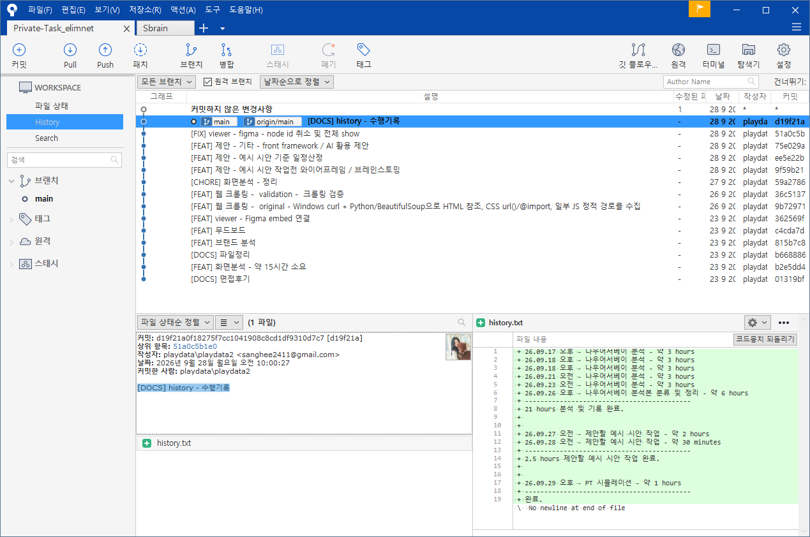
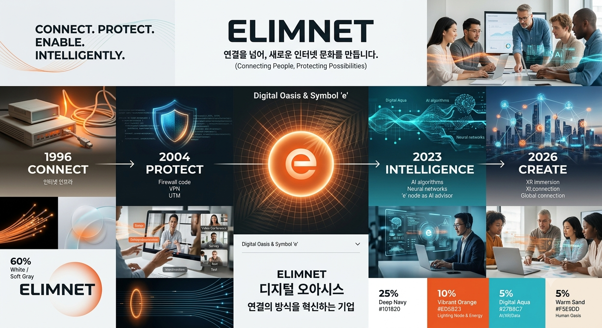
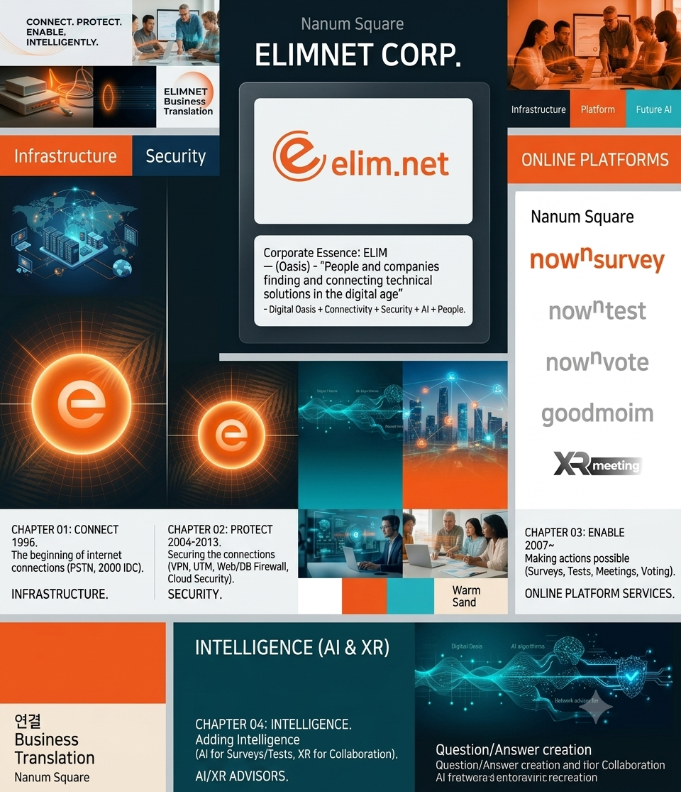
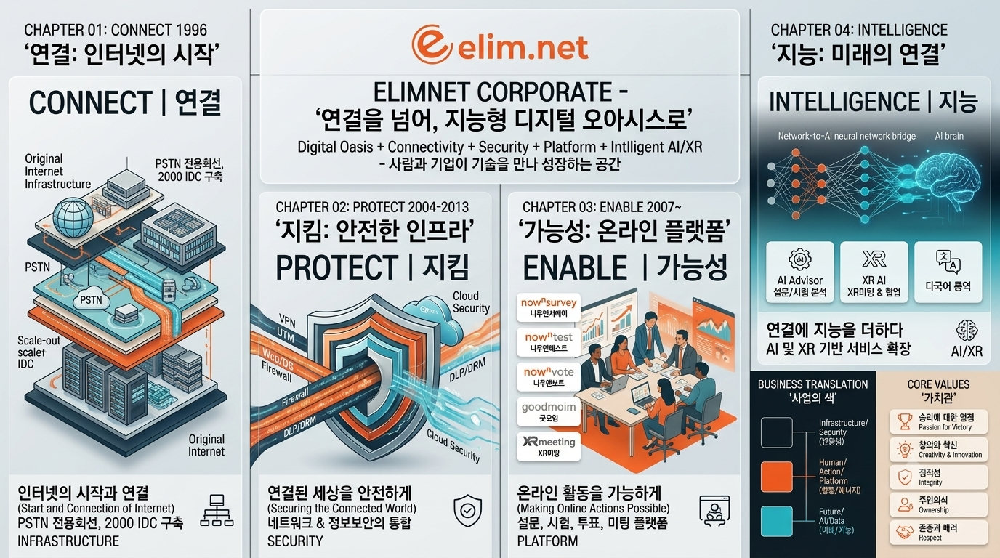
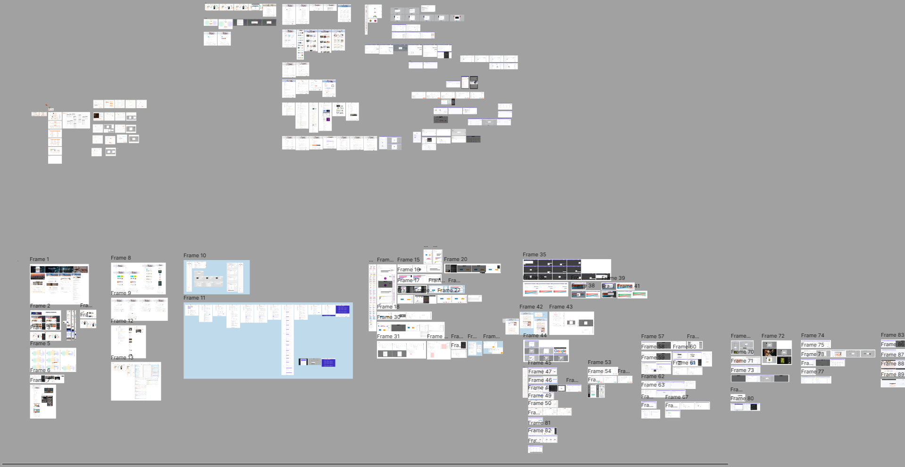

# 발표 시나리오

## 과제 내용
**과제 안내**: 2026.09.16 오후
- 나우앤서베이(https://www.nownsurvey.com) 플랫폼 서비스 전체를 사용해 보시고
  1) 사용자 관점에서 "나우앤서베이에 대한 제안사항, 개선사항"에 대해서 발표
  2) 만약 디자인 담당자가 된다면 "나우앤서베이 결과분석 페이지 개선 시안"에 대해서 발표

---

## 문서

### [DOCS] 면접후기
면접 과정에서의 질문과 답변 내용을 정리한 메모입니다.
- [면접메모.txt](https://github.com/StandOut-0/Private-Task/blob/main/%EB%A9%B4%EC%A0%91%EB%A9%94%EB%AA%A8.txt)

### [DOCS] history - 수행기록
프로젝트 전체 수행 과정을 시간순으로 기록한 문서입니다.
- [history.txt](https://github.com/StandOut-0/Private-Task/blob/main/history.txt)

---

## 브랜딩

### [FEAT] 브랜드 분석 및 무드보드
나우앤서베이의 브랜드 아이덴티티를 분석하고 시각적 방향성을 제시합니다.
- [브랜딩.txt](https://github.com/StandOut-0/Private-Task/blob/main/%EB%B8%8C%EB%9E%9C%EB%94%A9/%EB%B8%8C%EB%9E%9C%EB%94%A9.txt)

---

## 화면 분석

### [FEAT] 화면분석 - 약 21시간 소요
나우앤서베이 전체 화면을 분석하여 개선점을 도출했습니다.
- [분석.txt](https://github.com/StandOut-0/Private-Task/blob/main/%ED%99%94%EB%A9%B4%20%EB%A6%AC%EC%84%9C%EC%B9%98/%EB%B6%84%EC%84%9D.txt)

### [FEAT] 제안 - 예시 시안 작업전 와이어프레임 / 브레인스토밍
결과분석 페이지 개선 시안 작업 전 와이어프레임과 아이디어를 정리했습니다.
- [와이어프레임_리뉴얼.md](https://github.com/StandOut-0/Private-Task/blob/main/%ED%99%94%EB%A9%B4%20%EB%A6%AC%EC%84%9C%EC%B9%98/%EC%99%80%EC%9D%B4%EC%96%B4%ED%94%84%EB%A0%88%EC%9E%84_%EB%A6%AC%EB%89%B4%EC%96%BC.md)

### [FEAT] viewer - Figma embed 연결
Figma 디자인을 웹에서 바로 볼 수 있는 뷰어를 구현했습니다.
- [figma.html (GitHub)](https://github.com/StandOut-0/Private-Task/blob/main/figma.html)
- [figma.html (GitHub Pages)](https://standout-0.github.io/Private-Task/figma.html)

---

## 제안

### [FEAT] 제안 - 예시 시안 기준 일정산정
개선 시안 구현을 위한 상세 일정과 WBS를 작성했습니다.
- [일정_산정_WBS.md](https://github.com/StandOut-0/Private-Task/blob/main/%ED%99%94%EB%A9%B4%20%EB%A6%AC%EC%84%9C%EC%B9%98/%EC%9D%BC%EC%A0%95_%EC%82%B0%EC%A0%95_WBS.md)

### [FEAT] 제안 - 기타 - front framework / AI 활용 제안
프론트 프레임워크와 AI 기술 활용을 위한 기술적 제안서입니다.
- [프론트프레임워크_AI활용_제안서.md](https://github.com/StandOut-0/Private-Task/blob/main/%ED%94%84%EB%A1%A0%ED%8A%B8%ED%94%84%EB%A0%88%EC%9E%84%EC%9B%8C%ED%81%AC_AI%ED%99%9C%EC%9A%A9_%EC%A0%9C%EC%95%88%EC%84%9C.md)